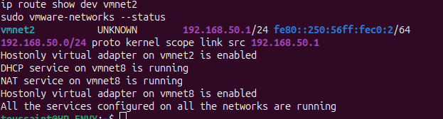

# VMware Lab Networking

## Objective

Provide an internal network for the enterprise home lab, with pfSense serving as the gateway and Windows Server providing internal infrastructure services.

## Network Configuration

| Network | Purpose | Verified configuration |
|---|---|---|
| vmnet2 | Internal lab segment | Host adapter enabled; 192.168.50.1/24 |
| vmnet8 | VMware NAT network | NAT and VMware DHCP services running |

## Internal Addressing

| Component | Address | Role |
|---|---|---|
| Ubuntu host — vmnet2 | 192.168.50.1/24 | Host access to the internal lab |
| pfSense LAN | 192.168.50.254/24 | Internal gateway |
| DC01 | 192.168.50.10/24 | AD DS, DNS, and Windows DHCP |

The host adapter address, 192.168.50.1, is distinct from the lab's default gateway, 192.168.50.254.

## Verification Commands

Executed on the Ubuntu host:

```bash
ip -brief address show vmnet2
ip route show dev vmnet2
sudo vmware-networks --status
```

## Observed Results

### Host Adapter

The vmnet2 interface reported:

```text
vmnet2  UNKNOWN  192.168.50.1/24
```

The interface has the expected IPv4 address. This output alone does not establish connectivity between virtual machines.

### Connected Route

```text
192.168.50.0/24 proto kernel scope link src 192.168.50.1
```

The host has a directly connected route to the internal lab subnet through vmnet2.

### VMware Services

```text
Hostonly virtual adapter on vmnet2 is enabled
DHCP service on vmnet8 is running
NAT service on vmnet8 is running
Hostonly virtual adapter on vmnet8 is enabled
All the services configured on all the networks are running
```

The status output confirms:

- The vmnet2 host adapter is enabled.
- VMware NAT and DHCP are running on vmnet8.
- No running VMware DHCP service is listed for vmnet2.

## DHCP Design

Windows DHCP on DC01 is the designated DHCP server for vmnet2.

VMware DHCP on vmnet8 serves a separate network segment. Its presence does not indicate a DHCP conflict on vmnet2.

Lab clients must connect to vmnet2 to test Windows DHCP on the internal network.

## Verification Boundaries

These checks confirm host addressing, routing, and VMware service status.

They do not independently verify:

- pfSense interface assignments or firewall rules.
- The Windows DHCP scope and options.
- Client lease assignment.
- Client DNS resolution or internet access.

## Next Validation

1. Confirm CLIENT01 is connected to vmnet2.
2. Verify the Windows DHCP scope is active.
3. Obtain a client lease.
4. Check the assigned DHCP server, gateway, and DNS server.
5. Test DNS resolution and network connectivity.
## Screenshot Evidence


